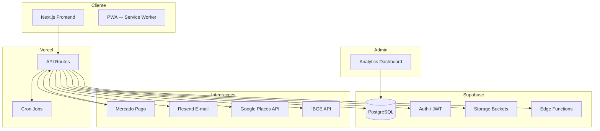

# Descomplicaí

> Plataforma completa de gestao de eventos, focada em casamentos e celebracoes. Conecta casais, fornecedores e cerimonialistas em um ecossistema integrado de planejamento, pagamentos e comunicacao.

---

## Visao Geral

O **Descomplicaí** e uma aplicacao web construida em **Next.js** com **Supabase** como backend (PostgreSQL + Auth + Storage). A plataforma suporta multiplos perfis de usuario (casal, fornecedor, cerimonialista, colaborador, admin) com fluxos de negocio distintos e interconectados.

### Stack Tecnologica

| Camada | Tecnologia |
|--------|------------|
| Frontend | Next.js 14/16 (Pages Router + App Router) |
| Backend | Supabase (PostgreSQL, Auth, Storage, Realtime) |
| Pagamentos | Mercado Pago (SDK + Webhooks) |
| E-mail | Resend (transacional) |
| Rate Limit | Upstash Redis |
| Monitoramento | Sentry |
| Hospedagem | Vercel |
| Testes | Jest + Playwright |
| CI/CD | GitHub Actions |

---

## Arquitetura



---

## Como Rodar (Desenvolvimento)

> ⚠️ **IMPORTANTE:** O build local **NUNCA** funciona sem `.env.local`. As variaveis de ambiente estao configuradas na Vercel. Para desenvolvimento, use o preview da Vercel ou configure `.env.local` manualmente com as credenciais necessarias.

### Pre-requisitos

- Node.js 18+
- npm 9+
- PostgreSQL client (para scripts de backup)

### Comandos

```bash
# Instalar dependencias
npm install

# Ambiente de desenvolvimento (requer .env.local)
npm run dev

# Build de producao
npm run build

# Testes unitarios
npm test

# Testes E2E (requer Chromium instalado)
npm run test:e2e

# Lint
npm run lint
```

---

## Estrutura de Pastas

```
├── components/
│   ├── admin/           # Painel administrativo
│   ├── analytics/       # Dashboards e metricas
│   ├── chat/            # Componentes de chat/mensagens
│   ├── memorial/        # Steps do memorial (70+ arquivos)
│   ├── painel/          # Painel do casal
│   ├── cerimonialista/  # Painel do cerimonialista
│   ├── fornecedores/    # Vitrine e cadastro de fornecedores
│   ├── financeiro/      # Gestao financeira
│   ├── mesas/           # Sistema de mesas inteligente
│   └── ui/              # Componentes base reutilizaveis
├── pages/
│   ├── api/             # API Routes (Next.js Pages Router)
│   ├── [rotas]/         # Paginas publicas e privadas
│   └── _app.jsx
├── app/                 # App Router (Next.js 14+)
├── components/          # Componentes compartilhados
├── utils/
│   ├── catalogoFornecedores.js   # Catalogo centralizado de categorias
│   ├── linguagemCasal.js         # Termos inclusivos (pessoa1/pessoa2)
│   ├── formatters.js             # Formatadores de data, moeda, etc.
│   └── gerador-memorial.js       # Geradores de PDF, tokens, etc.
├── hooks/               # Custom React hooks
├── context/
│   ├── AuthContext.js
│   └── MemorialContext.js
├── lib/                 # Clientes e conectores
│   ├── supabase.js      # Cliente Supabase (anon + service role)
│   ├── supabaseAdmin.js # Service role para APIs admin/cron
│   ├── mercadopago.js   # Configuracao do Mercado Pago
│   ├── email.js         # Cliente Resend
│   ├── uploadthing.js   # Upload de arquivos
│   ├── places.js        # Google Places API
│   ├── ibge.js          # API do IBGE
│   ├── ratelimit.js     # Rate limiting com Upstash
│   └── errorLogger.js   # Wrapper Sentry + fallback Supabase
├── scripts/             # Scripts utilitarios (backup, restore, deploy)
├── docs/                # Documentacao interna
├── sql/                 # Migrations e schemas SQL
├── supabase/
│   └── migrations/      # Migrations versionadas
├── e2e/                 # Testes Playwright
├── __tests__/           # Testes Jest
└── .github/workflows/   # CI/CD (GitHub Actions)
```

---

## Fluxos Principais

### 1. Memorial
```
Casal preenche steps → Gera PDF → Pagamento → Download final
```
- 70+ steps com linguagem inclusiva (pessoa1/pessoa2)
- Pulsos visuais + ARIA em todos os componentes
- Geracao de PDF com template customizado

### 2. Fornecedor
```
Cadastro → Trial (7 dias) → Pagamento → Aprovacao Admin → Vitrine publica
```
- Catalogo de categorias centralizado (`utils/catalogoFornecedores.js`)
- Sistema de trial com controle de expiracao
- Integracao com Mercado Pago para assinaturas

### 3. Cerimonialista
```
Painel → Leads → Modelos → Financeiro → Biblioteca de fornecedores favoritos
```
- Painel espelhado com permissoes CRUD
- Biblioteca de fornecedores favoritos
- Gestao de leads e modelos de evento
- Assistentes com permissoes granulares

### 4. Colaborador
```
Convite por e-mail → Token de ativacao → Permissoes no evento
```
- Sistema de convites com tokens unicos
- Niveis de permissao (leitura, edicao, admin)

---

## Variaveis de Ambiente

### Obrigatorias

| Variavel | Descricao |
|----------|-----------|
| `NEXT_PUBLIC_SUPABASE_URL` | URL do projeto Supabase |
| `NEXT_PUBLIC_SUPABASE_ANON_KEY` | Chave anonima do Supabase |
| `SUPABASE_SERVICE_ROLE_KEY` | Service role key (APIs admin/cron) |
| `NEXT_PUBLIC_SITE_URL` | URL publica da aplicacao |
| `MERCADO_PAGO_ACCESS_TOKEN` | Token de acesso do Mercado Pago |
| `MERCADO_PAGO_PUBLIC_KEY` | Chave publica do Mercado Pago |
| `RESEND_API_KEY` | API key do Resend (e-mail) |
| `RESEND_FROM_EMAIL` | E-mail de origem (ex: noreply@descomplicai.com.br) |

### Opcionais

| Variavel | Descricao |
|----------|-----------|
| `NEXT_PUBLIC_GOOGLE_PLACES_API_KEY` | Google Places API (busca de enderecos) |
| `UPLOADTHING_SECRET` | UploadThing (upload de arquivos) |
| `UPLOADTHING_APP_ID` | ID da aplicacao UploadThing |
| `NEXT_PUBLIC_VLBRAS_ENABLED` | Habilitar VLibras (desabilitado no lancamento) |

### Apenas Producao

| Variavel | Descricao |
|----------|-----------|
| `VERCEL_URL` | Injetada automaticamente pela Vercel |
| `CRON_SECRET` | Token para proteger rotas de cron job |
| `ADMIN_EMAILS` | Lista de e-mails com acesso ao painel admin |
| `UPSTASH_REDIS_REST_URL` | URL do Redis Upstash (rate limit) |
| `UPSTASH_REDIS_REST_TOKEN` | Token do Redis Upstash |
| `SENTRY_DSN` | DSN do Sentry |
| `SENTRY_AUTH_TOKEN` | Auth token do Sentry |
| `SENTRY_ORG` | Organizacao no Sentry |
| `SENTRY_PROJECT` | Projeto no Sentry |

---

## Comandos Uteis

| Comando | Descricao |
|---------|-----------|
| `npm run dev` | Inicia servidor de desenvolvimento |
| `npm run build` | Build de producao |
| `npm test` | Testes unitarios (Jest) |
| `npm run test:e2e` | Testes E2E (Playwright) |
| `npm run lint` | Verificacao de lint |
| `./scripts/backup.sh full` | Backup local do banco (schema + dados) |
| `./scripts/backup.sh schema` | Backup apenas do schema |
| `./scripts/restore.sh <schema.sql> [data.sql]` | Restore de emergencia |

---

## Documentacao Adicional

- [`docs/BACKUP.md`](docs/BACKUP.md) — Estrategia de backup do banco
- [`docs/ERD.md`](docs/ERD.md) — Diagrama de relacionamento das tabelas
- [`docs/CONTRIBUTING.md`](docs/CONTRIBUTING.md) — Guia de contribuicao
- [`CHANGELOG.md`](CHANGELOG.md) — Historico de versoes
- [`DEPLOY.md`](DEPLOY.md) — Guia de deploy na Vercel
- [`README-PERFORMANCE.md`](README-PERFORMANCE.md) — Otimizacoes de performance

---

## Licenca

Proprietaria — Descomplicaí. Todos os direitos reservados.
