# Diagrama de Relacionamento (ERD) — Descomplicaí

> Diagrama gerado a partir do schema real do banco de dados (Supabase PostgreSQL). Atualizado em 2026-06-30.

---

## Diagrama Mermaid

```mermaid
erDiagram
    %% Tabelas principais
    users ||--o{ eventos : "possui"
    users ||--o{ memoriais : "preenche"
    users ||--o{ pagamentos : "realiza"
    users ||--o{ admins : "eh"

    eventos ||--o{ fornecedores : "contrata"
    eventos ||--o{ convidados : "convida"
    eventos ||--o{ cronograma : "programa"
    eventos ||--o{ mesas : "organiza"
    eventos ||--o{ mesas_tipos : "define"
    eventos ||--o{ grupos_convidados : "agrupa"
    eventos ||--o{ mensagens : "troca"
    eventos ||--o{ chat_mensagens : "conversa"
    eventos ||--o{ contratos : "assinam"
    eventos ||--o{ financeiro : "controla"
    eventos ||--o{ tarefas : "gerencia"
    eventos ||--o{ colaboradores : "convida"
    eventos ||--o{ cerimonialista_permissoes : "permite"
    eventos ||--o{ cerimonialista_roteiro_itens : "roteiriza"
    eventos ||--o{ cerimonialista_assistente_permissoes : "delega"

    cerimonialistas ||--o{ eventos : "gerencia"
    cerimonialistas ||--o{ cerimonialista_leads : "capta"
    cerimonialistas ||--o{ cerimonialista_modelos : "cria"
    cerimonialistas ||--o{ cerimonialista_financeiro : "controla"
    cerimonialistas ||--o{ cerimonialista_fornecedores_favoritos : "favorita"
    cerimonialistas ||--o{ cerimonialista_assistentes : "contrata"
    cerimonialistas ||--o{ cerimonialista_permissoes : "recebe"
    cerimonialistas ||--o{ cerimonialista_roteiro_itens : "escreve"

    cerimonialista_assistentes ||--o{ cerimonialista_assistente_permissoes : "tem"

    fornecedores_plataforma ||--o{ avaliacoes : "recebe"
    fornecedores_plataforma ||--o{ cliques_fornecedor : "gera"
    fornecedores_plataforma ||--o{ metricas_fornecedor : "acumula"
    fornecedores_plataforma ||--o{ pagamentos : "recebe"

    fornecedores ||--o{ contratos : "assinam"
    fornecedores ||--o{ cronograma : "executa"
    fornecedores ||--o{ financeiro : "fatura"
    fornecedores ||--o{ tarefas : "realiza"
    fornecedores ||--o{ cerimonialista_fornecedores_favoritos : "favoritado"

    mesas_tipos ||--o{ mesas : "tipifica"

    memoriais ||--o{ eventos : "gera"

    %% Entidades
    users {
        uuid id PK
        text email
        %% Auth managed by Supabase
    }

    admins {
        uuid id PK
        uuid usuario_id FK "→ users"
        text email
        timestamptz criado_em
    }

    eventos {
        uuid id PK
        uuid usuario_id FK "→ users"
        uuid cerimonialista_id FK "→ cerimonialistas"
        uuid memoriais_id FK "→ memoriais"
        boolean casal_confirmado
    }

    memoriais {
        uuid id PK
        uuid user_id FK "→ users (unique)"
        uuid evento_id FK "→ eventos"
        jsonb dados
    }

    fornecedores {
        uuid id PK
        uuid evento_id FK "→ eventos"
        boolean pre_criado
    }

    fornecedores_plataforma {
        uuid id PK
        text categoria
        text cidade
        text estado
    }

    avaliacoes {
        uuid id PK
        uuid fornecedor_id FK "→ fornecedores_plataforma"
        uuid usuario_id FK "→ users"
        integer nota
        text comentario
        timestamptz criado_em
    }

    cliques_fornecedor {
        uuid id PK
        uuid fornecedor_id FK "→ fornecedores_plataforma"
        timestamptz criado_em
    }

    metricas_fornecedor {
        uuid id PK
        uuid fornecedor_id FK "→ fornecedores_plataforma"
        date dia
    }

    pagamentos {
        uuid id PK
        uuid usuario_id FK "→ users"
        uuid fornecedor_id FK "→ fornecedores_plataforma"
        uuid evento_id FK "→ eventos"
    }

    convidados {
        uuid id PK
        uuid evento_id FK "→ eventos"
        uuid mesa_id FK "→ mesas"
    }

    mesas {
        uuid id PK
        uuid evento_id FK "→ eventos"
        uuid tipo_id FK "→ mesas_tipos"
    }

    mesas_tipos {
        uuid id PK
        uuid evento_id FK "→ eventos"
    }

    mesas_backup {
        uuid id PK
        uuid evento_id FK "→ eventos"
    }

    grupos_convidados {
        uuid id PK
        uuid evento_id FK "→ eventos"
        text nome
    }

    cronograma {
        uuid id PK
        uuid evento_id FK "→ eventos"
        uuid fornecedor_id FK "→ fornecedores"
    }

    tarefas {
        uuid id PK
        uuid evento_id FK "→ eventos"
        uuid fornecedor_id FK "→ fornecedores"
        boolean gerada_auto
    }

    financeiro {
        uuid id PK
        uuid evento_id FK "→ eventos"
        uuid fornecedor_origem_id FK "→ fornecedores"
    }

    contratos {
        uuid id PK
        uuid evento_id FK "→ eventos"
        uuid fornecedor_id FK "→ fornecedores"
        text status
        text token_assinatura
    }

    mensagens {
        uuid id PK
        uuid evento_id FK "→ eventos"
        boolean lida
        timestamptz criado_em
    }

    chat_mensagens {
        uuid id PK
        uuid evento_id FK "→ eventos"
    }

    colaboradores {
        uuid id PK
        uuid evento_id FK "→ eventos"
        text token "unique"
    }

    cerimonialistas {
        uuid id PK
        boolean ativo
    }

    cerimonialista_leads {
        uuid id PK
        uuid cerimonialista_id FK "→ cerimonialistas"
        uuid convertido_evento_id FK "→ eventos"
        text nome_lead
        text email
        text telefone
        text tipo_evento
        date data_prevista
        numeric valor_proposta
        text estagio
        text fonte
        text notas
        timestamp criado_em
        timestamp atualizado_em
    }

    cerimonialista_modelos {
        uuid id PK
        uuid cerimonialista_id FK "→ cerimonialistas"
        text tipo
        text nome
        text conteudo
        jsonb variaveis
        timestamp criado_em
    }

    cerimonialista_financeiro {
        uuid id PK
        uuid cerimonialista_id FK "→ cerimonialistas"
        uuid evento_id FK "→ eventos"
        text tipo
        text categoria
        text descricao
        numeric valor
        date data_vencimento
        boolean pago
        timestamp criado_em
    }

    cerimonialista_fornecedores_favoritos {
        uuid id PK
        uuid cerimonialista_id FK "→ cerimonialistas"
        uuid fornecedor_id FK "→ fornecedores"
        text nome_fornecedor
        text categoria
        text telefone
        text email
        text instagram
        text notas_internas
        timestamp criado_em
    }

    cerimonialista_assistentes {
        uuid id PK
        uuid cerimonialista_id FK "→ cerimonialistas"
        uuid usuario_id FK "→ users"
        text nome
        text email
        text acesso
        boolean ativo
        timestamp criado_em
    }

    cerimonialista_assistente_permissoes {
        uuid id PK
        uuid assistente_id FK "→ cerimonialista_assistentes"
        uuid evento_id FK "→ eventos"
        boolean ver_fornecedores
        boolean ver_financeiro
        boolean ver_tarefas
        boolean ver_convidados
        boolean ver_chat
        boolean ver_cronograma
        boolean ver_contratos
        boolean ver_mesas
        boolean ver_memorial
        timestamptz criado_em
        timestamptz atualizado_em
    }

    cerimonialista_permissoes {
        uuid id PK
        uuid evento_id FK "→ eventos"
        uuid cerimonialista_id FK "→ cerimonialistas"
        boolean ver_fornecedores
        boolean editar_fornecedores
        boolean ver_financeiro
        boolean editar_financeiro
        boolean ver_tarefas
        boolean editar_tarefas
        boolean ver_convidados
    }

    cerimonialista_roteiro_itens {
        uuid id PK
        uuid cerimonialista_id FK "→ cerimonialistas"
        uuid evento_id FK "→ eventos"
        integer ordem
    }

    analytics_eventos {
        uuid id PK
        uuid usuario_id FK "→ users"
        text sessao_id
        text evento_tipo
        text categoria
        text acao
        text pagina
        text step_id
        uuid fornecedor_id FK "→ fornecedores_plataforma"
        uuid evento_id FK "→ eventos"
        numeric valor
        integer tempo_na_pagina
        jsonb dados
        text user_agent
        text ip
        text origem
        timestamptz criado_em
    }

    configuracoes {
        uuid id PK
        text chave "unique"
        text categoria
        text valor
    }
```

---

## Tabelas Detalhadas

### users (auth.users — gerenciada pelo Supabase)
| Coluna | Tipo | Nullable | Default | Descricao |
|--------|------|----------|---------|-----------|
| id | uuid | NO | gen_random_uuid() | PK — Auth do Supabase |
| email | text | — | — | E-mail do usuario |

> RLS: Sim (gerenciada pelo Supabase Auth)

---

### admins
| Coluna | Tipo | Nullable | Default | Descricao |
|--------|------|----------|---------|-----------|
| id | uuid | NO | gen_random_uuid() | PK |
| usuario_id | uuid | NO | — | FK → users (unique) |
| email | text | YES | — | E-mail do admin |
| criado_em | timestamptz | YES | now() | |

**Indices:**
- `admins_pkey` (id) — UNIQUE
- `admins_usuario_id_key` (usuario_id) — UNIQUE

**RLS:** ✅ Sim

---

### analytics_eventos
| Coluna | Tipo | Nullable | Default | Descricao |
|--------|------|----------|---------|-----------|
| id | uuid | NO | gen_random_uuid() | PK |
| usuario_id | uuid | YES | — | FK → users |
| sessao_id | text | NO | — | ID da sessao |
| evento_tipo | text | NO | — | Tipo do evento |
| categoria | text | YES | — | Categoria |
| acao | text | YES | — | Acao realizada |
| pagina | text | YES | — | Pagina acessada |
| step_id | text | YES | — | Step do memorial |
| fornecedor_id | uuid | YES | — | FK → fornecedores_plataforma |
| evento_id | uuid | YES | — | FK → eventos |
| valor | numeric | YES | — | Valor monetario |
| tempo_na_pagina | integer | YES | — | Tempo em segundos |
| dados | jsonb | YES | — | Dados extras |
| user_agent | text | YES | — | User-Agent |
| ip | text | YES | — | IP do usuario |
| origem | text | YES | — | Origem do trafego |
| criado_em | timestamptz | YES | now() | |

**Indices:**
- `analytics_eventos_pkey` (id) — UNIQUE
- `idx_analytics_criado_em` (criado_em DESC)
- `idx_analytics_dados` (dados) — GIN
- `idx_analytics_pagina` (pagina, criado_em DESC) — WHERE pagina IS NOT NULL
- `idx_analytics_sessao` (sessao_id, criado_em DESC)
- `idx_analytics_step` (step_id, criado_em DESC) — WHERE step_id IS NOT NULL
- `idx_analytics_tipo` (evento_tipo, categoria, criado_em DESC)
- `idx_analytics_usuario` (usuario_id, criado_em DESC)

**RLS:** ✅ Sim

---

### avaliacoes
| Coluna | Tipo | Nullable | Default | Descricao |
|--------|------|----------|---------|-----------|
| id | uuid | NO | gen_random_uuid() | PK |
| fornecedor_id | uuid | NO | — | FK → fornecedores_plataforma |
| usuario_id | uuid | NO | — | FK → users |
| nota | integer | NO | — | Nota 1-5 |
| comentario | text | YES | — | Comentario textual |
| criado_em | timestamptz | YES | now() | |

**Indices:**
- `avaliacoes_pkey` (id) — UNIQUE

**RLS:** ✅ Sim

---

### cerimonialista_assistente_permissoes
| Coluna | Tipo | Nullable | Default | Descricao |
|--------|------|----------|---------|-----------|
| id | uuid | NO | gen_random_uuid() | PK |
| assistente_id | uuid | NO | — | FK → cerimonialista_assistentes |
| evento_id | uuid | NO | — | FK → eventos |
| ver_fornecedores | boolean | YES | false | |
| ver_financeiro | boolean | YES | false | |
| ver_tarefas | boolean | YES | false | |
| ver_convidados | boolean | YES | false | |
| ver_chat | boolean | YES | false | |
| ver_cronograma | boolean | YES | false | |
| ver_contratos | boolean | YES | false | |
| ver_mesas | boolean | YES | false | |
| ver_memorial | boolean | YES | true | |
| criado_em | timestamptz | YES | now() | |
| atualizado_em | timestamptz | YES | now() | |

**Indices:**
- `cerimonialista_assistente_permissoes_pkey` (id) — UNIQUE
- `cerimonialista_assistente_permissoe_assistente_id_evento_id_key` (assistente_id, evento_id) — UNIQUE
- `idx_assistente_permissoes_assistente` (assistente_id)
- `idx_assistente_permissoes_evento` (evento_id)

**RLS:** ✅ Sim

---

### cerimonialista_assistentes
| Coluna | Tipo | Nullable | Default | Descricao |
|--------|------|----------|---------|-----------|
| id | uuid | NO | gen_random_uuid() | PK |
| cerimonialista_id | uuid | NO | — | FK → cerimonialistas |
| usuario_id | uuid | NO | — | FK → users |
| nome | text | NO | — | Nome do assistente |
| email | text | NO | — | E-mail |
| acesso | text | YES | 'operacional' | Nivel de acesso |
| ativo | boolean | YES | true | |
| criado_em | timestamp | YES | now() | |

**Indices:**
- `cerimonialista_assistentes_pkey` (id) — UNIQUE

**RLS:** ✅ Sim

---

### cerimonialista_financeiro
| Coluna | Tipo | Nullable | Default | Descricao |
|--------|------|----------|---------|-----------|
| id | uuid | NO | gen_random_uuid() | PK |
| cerimonialista_id | uuid | NO | — | FK → cerimonialistas |
| evento_id | uuid | YES | — | FK → eventos |
| tipo | text | YES | — | Receita/despesa |
| categoria | text | YES | — | Categoria |
| descricao | text | YES | — | Descricao |
| valor | numeric | NO | — | Valor |
| data_vencimento | date | YES | — | |
| pago | boolean | YES | false | |
| criado_em | timestamp | YES | now() | |

**Indices:**
- `cerimonialista_financeiro_pkey` (id) — UNIQUE

**RLS:** ✅ Sim

---

### cerimonialista_fornecedores_favoritos
| Coluna | Tipo | Nullable | Default | Descricao |
|--------|------|----------|---------|-----------|
| id | uuid | NO | gen_random_uuid() | PK |
| cerimonialista_id | uuid | NO | — | FK → cerimonialistas |
| nome_fornecedor | text | NO | — | Nome do fornecedor |
| categoria | text | YES | — | Categoria |
| telefone | text | YES | — | |
| email | text | YES | — | |
| instagram | text | YES | — | |
| notas_internas | text | YES | — | |
| fornecedor_id | uuid | YES | — | FK → fornecedores |
| criado_em | timestamp | YES | now() | |

**Indices:**
- `cerimonialista_fornecedores_favoritos_pkey` (id) — UNIQUE

**RLS:** ✅ Sim

---

### cerimonialista_leads
| Coluna | Tipo | Nullable | Default | Descricao |
|--------|------|----------|---------|-----------|
| id | uuid | NO | gen_random_uuid() | PK |
| cerimonialista_id | uuid | NO | — | FK → cerimonialistas |
| nome_lead | text | NO | — | Nome do lead |
| email | text | YES | — | |
| telefone | text | YES | — | |
| tipo_evento | text | YES | — | |
| data_prevista | date | YES | — | |
| valor_proposta | numeric | YES | — | |
| estagio | text | YES | 'contato_inicial' | |
| fonte | text | YES | — | |
| notas | text | YES | — | |
| convertido_evento_id | uuid | YES | — | FK → eventos |
| criado_em | timestamp | YES | now() | |
| atualizado_em | timestamp | YES | now() | |

**Indices:**
- `cerimonialista_leads_pkey` (id) — UNIQUE
- `idx_leads_cerimonialista` (cerimonialista_id, estagio)

**RLS:** ✅ Sim

---

### cerimonialista_modelos
| Coluna | Tipo | Nullable | Default | Descricao |
|--------|------|----------|---------|-----------|
| id | uuid | NO | gen_random_uuid() | PK |
| cerimonialista_id | uuid | NO | — | FK → cerimonialistas |
| tipo | text | YES | — | Tipo do modelo |
| nome | text | NO | — | Nome do modelo |
| conteudo | text | YES | — | Conteudo do template |
| variaveis | jsonb | YES | — | Variaveis dinamicas |
| criado_em | timestamp | YES | now() | |

**Indices:**
- `cerimonialista_modelos_pkey` (id) — UNIQUE

**RLS:** ✅ Sim

---

### cerimonialista_permissoes
| Coluna | Tipo | Nullable | Default | Descricao |
|--------|------|----------|---------|-----------|
| id | uuid | NO | gen_random_uuid() | PK |
| evento_id | uuid | NO | — | FK → eventos |
| cerimonialista_id | uuid | NO | — | FK → cerimonialistas |
| ver_fornecedores | boolean | YES | false | |
| editar_fornecedores | boolean | YES | false | |
| ver_financeiro | boolean | YES | false | |
| editar_financeiro | boolean | YES | false | |
| ver_tarefas | boolean | YES | false | |
| editar_tarefas | boolean | YES | false | |
| ver_convidados | boolean | YES | false | |

> ⚠️ *Nota: colunas apos `ver_convidados` podem existir (CSV truncado).*

**Indices:**
- `cerimonialista_permissoes_pkey` (id) — UNIQUE
- `cerimonialista_permissoes_evento_id_cerimonialista_id_key` (evento_id, cerimonialista_id) — UNIQUE
- `idx_permissoes_cerimonialista` (cerimonialista_id)
- `idx_permissoes_evento` (evento_id)

**RLS:** ✅ Sim

---

### cerimonialista_roteiro_itens
| Coluna | Tipo | Nullable | Default | Descricao |
|--------|------|----------|---------|-----------|
| id | uuid | NO | gen_random_uuid() | PK |
| cerimonialista_id | uuid | NO | — | FK → cerimonialistas |
| evento_id | uuid | NO | — | FK → eventos |
| ordem | integer | — | — | Ordenacao do item |

> ⚠️ *Nota: colunas adicionais (horario, descricao, etc.) podem existir.*

**Indices:**
- `cerimonialista_roteiro_itens_pkey` (id) — UNIQUE
- `idx_roteiro_cerimonialista` (cerimonialista_id)
- `idx_roteiro_evento` (evento_id)
- `idx_roteiro_ordem` (evento_id, ordem)

**RLS:** ✅ Sim

---

### cerimonialistas
| Coluna | Tipo | Nullable | Default | Descricao |
|--------|------|----------|---------|-----------|
| id | uuid | NO | gen_random_uuid() | PK |
| ativo | boolean | YES | — | |

> ⚠️ *Nota: colunas adicionais (nome, email, usuario_id, etc.) podem existir.*

**Indices:**
- `cerimonialistas_pkey` (id) — UNIQUE
- `idx_cerimonialistas_ativo` (ativo) — WHERE ativo = true

**RLS:** ✅ Sim

---

### chat_mensagens
| Coluna | Tipo | Nullable | Default | Descricao |
|--------|------|----------|---------|-----------|
| id | uuid | NO | gen_random_uuid() | PK |
| evento_id | uuid | NO | — | FK → eventos |

> ⚠️ *Nota: colunas adicionais (remetente_id, conteudo, lida, criado_em, etc.) podem existir.*

**Indices:**
- `chat_mensagens_pkey` (id) — UNIQUE
- `idx_chat_evento_id` (evento_id)

**RLS:** ✅ Sim

---

### cliques_fornecedor
| Coluna | Tipo | Nullable | Default | Descricao |
|--------|------|----------|---------|-----------|
| id | uuid | NO | gen_random_uuid() | PK |
| fornecedor_id | uuid | NO | — | FK → fornecedores_plataforma |
| criado_em | timestamptz | YES | now() | |

> ⚠️ *Nota: colunas adicionais (usuario_id, ip, origem, etc.) podem existir.*

**Indices:**
- `cliques_fornecedor_pkey` (id) — UNIQUE
- `idx_cliques_fornecedor_data` (criado_em)
- `idx_cliques_fornecedor_id` (fornecedor_id)

**RLS:** ❌ Nao (nao aparece na lista de RLS)

---

### colaboradores
| Coluna | Tipo | Nullable | Default | Descricao |
|--------|------|----------|---------|-----------|
| id | uuid | NO | gen_random_uuid() | PK |
| evento_id | uuid | NO | — | FK → eventos |
| token | text | NO | — | Token unico de convite |

> ⚠️ *Nota: colunas adicionais (nome, email, permissoes, criado_em, etc.) podem existir.*

**Indices:**
- `colaboradores_pkey` (id) — UNIQUE
- `colaboradores_token_key` (token) — UNIQUE
- `idx_colaboradores_token` (token)

**RLS:** ✅ Sim

---

### configuracoes
| Coluna | Tipo | Nullable | Default | Descricao |
|--------|------|----------|---------|-----------|
| id | uuid | NO | gen_random_uuid() | PK |
| chave | text | NO | — | Nome da configuracao (unique) |
| categoria | text | YES | — | Categoria |
| valor | text | YES | — | Valor da configuracao |

> ⚠️ *Nota: colunas adicionais (descricao, atualizado_em, etc.) podem existir.*

**Indices:**
- `configuracoes_pkey` (id) — UNIQUE
- `configuracoes_chave_key` (chave) — UNIQUE
- `idx_configuracoes_categoria` (categoria)
- `idx_configuracoes_chave` (chave)

**RLS:** ✅ Sim

---

### contratos
| Coluna | Tipo | Nullable | Default | Descricao |
|--------|------|----------|---------|-----------|
| id | uuid | NO | gen_random_uuid() | PK |
| evento_id | uuid | NO | — | FK → eventos |
| fornecedor_id | uuid | NO | — | FK → fornecedores |
| status | text | YES | — | Status do contrato |
| token_assinatura | text | YES | — | Token para assinatura |

> ⚠️ *Nota: colunas adicionais (conteudo, assinado_em, noivo_assinou, noiva_assinou, etc.) podem existir.*

**Indices:**
- `contratos_pkey` (id) — UNIQUE
- `idx_contratos_evento` (evento_id)
- `idx_contratos_fornecedor` (fornecedor_id)
- `idx_contratos_status` (status)
- `idx_contratos_token` (token_assinatura)

**RLS:** ✅ Sim

---

### convidados
| Coluna | Tipo | Nullable | Default | Descricao |
|--------|------|----------|---------|-----------|
| id | uuid | NO | gen_random_uuid() | PK |
| evento_id | uuid | NO | — | FK → eventos |
| mesa_id | uuid | YES | — | FK → mesas |

> ⚠️ *Nota: colunas adicionais (nome, email, telefone, confirmado, grupo_id, etc.) podem existir.*

**Indices:**
- `convidados_pkey` (id) — UNIQUE

**RLS:** ✅ Sim

---

### cronograma
| Coluna | Tipo | Nullable | Default | Descricao |
|--------|------|----------|---------|-----------|
| id | uuid | NO | gen_random_uuid() | PK |
| evento_id | uuid | NO | — | FK → eventos |
| fornecedor_id | uuid | YES | — | FK → fornecedores |

> ⚠️ *Nota: colunas adicionais (horario, descricao, duracao, etc.) podem existir.*

**Indices:**
- `cronograma_pkey` (id) — UNIQUE

**RLS:** ✅ Sim

---

### eventos
| Coluna | Tipo | Nullable | Default | Descricao |
|--------|------|----------|---------|-----------|
| id | uuid | NO | gen_random_uuid() | PK |
| usuario_id | uuid | YES | — | FK → users |
| cerimonialista_id | uuid | YES | — | FK → cerimonialistas |
| memoriais_id | uuid | YES | — | FK → memoriais |
| casal_confirmado | boolean | YES | — | |

> ⚠️ *Nota: colunas adicionais (data, cidade, orcamento, nome_pessoa1, nome_pessoa2, etc.) podem existir.*

**Indices:**
- `eventos_pkey` (id) — UNIQUE
- `idx_eventos_casal_confirmado` (casal_confirmado)
- `idx_eventos_cerimonialista_id` (cerimonialista_id)
- `idx_eventos_memoriais_id` (memoriais_id)
- `idx_eventos_usuario_id` (usuario_id)

**RLS:** ✅ Sim

---

### financeiro
| Coluna | Tipo | Nullable | Default | Descricao |
|--------|------|----------|---------|-----------|
| id | uuid | NO | gen_random_uuid() | PK |
| evento_id | uuid | NO | — | FK → eventos |
| fornecedor_origem_id | uuid | YES | — | FK → fornecedores |

> ⚠️ *Nota: colunas adicionais (tipo, categoria, descricao, valor, pago, data_vencimento, etc.) podem existir.*

**Indices:**
- `financeiro_pkey` (id) — UNIQUE

**RLS:** ✅ Sim

---

### fornecedores
| Coluna | Tipo | Nullable | Default | Descricao |
|--------|------|----------|---------|-----------|
| id | uuid | NO | gen_random_uuid() | PK |
| evento_id | uuid | YES | — | FK → eventos |
| pre_criado | boolean | YES | — | |

> ⚠️ *Nota: colunas adicionais (nome, categoria, telefone, email, status, etc.) podem existir.*

**Indices:**
- `fornecedores_pkey` (id) — UNIQUE
- `idx_fornecedores_pre_criado` (evento_id, pre_criado) — WHERE pre_criado = true

**RLS:** ✅ Sim

---

### fornecedores_plataforma
| Coluna | Tipo | Nullable | Default | Descricao |
|--------|------|----------|---------|-----------|
| id | uuid | NO | gen_random_uuid() | PK |
| categoria | text | YES | — | Categoria do fornecedor |
| cidade | text | YES | — | |
| estado | text | YES | — | |

> ⚠️ *Nota: colunas adicionais (nome, descricao, telefone, email, instagram, site, portfolio, ativo, trial_expira_em, etc.) podem existir.*

**Indices:**
- `fornecedores_plataforma_pkey` (id) — UNIQUE
- `idx_forn_plat_categoria` (categoria)
- `idx_forn_plat_cidade` (cidade, estado)

**RLS:** ✅ Sim

---

### grupos_convidados
| Coluna | Tipo | Nullable | Default | Descricao |
|--------|------|----------|---------|-----------|
| id | uuid | NO | gen_random_uuid() | PK |
| evento_id | uuid | NO | — | FK → eventos |
| nome | text | NO | — | Nome do grupo |

> ⚠️ *Nota: colunas adicionais (cor, icone, criado_em, etc.) podem existir.*

**Indices:**
- `grupos_convidados_pkey` (id) — UNIQUE
- `grupos_convidados_evento_id_nome_key` (evento_id, nome) — UNIQUE

**RLS:** ✅ Sim

---

### memoriais
| Coluna | Tipo | Nullable | Default | Descricao |
|--------|------|----------|---------|-----------|
| id | uuid | NO | gen_random_uuid() | PK |
| user_id | uuid | YES | — | FK → users (unique) |
| evento_id | uuid | YES | — | FK → eventos |
| dados | jsonb | YES | — | Dados do memorial |

> ⚠️ *Nota: colunas adicionais (criado_em, atualizado_em, pdf_url, etc.) podem existir.*

**Indices:**
- `memoriais_pkey` (id) — UNIQUE
- `memoriais_user_id_key` (user_id) — UNIQUE
- `idx_memoriais_evento_id` (evento_id)
- `idx_memoriais_user_id` (user_id)

**RLS:** ✅ Sim

---

### mensagens
| Coluna | Tipo | Nullable | Default | Descricao |
|--------|------|----------|---------|-----------|
| id | uuid | NO | gen_random_uuid() | PK |
| evento_id | uuid | NO | — | FK → eventos |
| lida | boolean | YES | — | |
| criado_em | timestamptz | YES | — | |

> ⚠️ *Nota: colunas adicionais (remetente_id, destinatario_id, conteudo, tipo, etc.) podem existir.*

**Indices:**
- `mensagens_pkey` (id) — UNIQUE
- `idx_mensagens_evento` (evento_id, criado_em DESC)
- `idx_mensagens_nao_lidas` (evento_id, lida) — WHERE lida = false

**RLS:** ✅ Sim

---

### mesas
| Coluna | Tipo | Nullable | Default | Descricao |
|--------|------|----------|---------|-----------|
| id | uuid | NO | gen_random_uuid() | PK |
| evento_id | uuid | NO | — | FK → eventos |
| tipo_id | uuid | YES | — | FK → mesas_tipos |

> ⚠️ *Nota: colunas adicionais (numero, nome, capacidade, posicao_x, posicao_y, etc.) podem existir.*

**Indices:**
- `mesas_pkey1` (id) — UNIQUE

**RLS:** ✅ Sim

---

### mesas_backup
| Coluna | Tipo | Nullable | Default | Descricao |
|--------|------|----------|---------|-----------|
| id | uuid | NO | gen_random_uuid() | PK |
| evento_id | uuid | NO | — | FK → eventos |

> ⚠️ *Nota: colunas adicionais (dados_json, criado_em, etc.) podem existir.*

**Indices:**
- `mesas_pkey` (id) — UNIQUE

**RLS:** ✅ Sim

---

### mesas_tipos
| Coluna | Tipo | Nullable | Default | Descricao |
|--------|------|----------|---------|-----------|
| id | uuid | NO | gen_random_uuid() | PK |
| evento_id | uuid | NO | — | FK → eventos |

> ⚠️ *Nota: colunas adicionais (nome, capacidade, formato, cor, etc.) podem existir.*

**Indices:**
- `mesas_tipos_pkey` (id) — UNIQUE

**RLS:** ✅ Sim

---

### metricas_fornecedor
| Coluna | Tipo | Nullable | Default | Descricao |
|--------|------|----------|---------|-----------|
| id | uuid | NO | gen_random_uuid() | PK |
| fornecedor_id | uuid | NO | — | FK → fornecedores_plataforma |
| dia | date | NO | — | |

> ⚠️ *Nota: colunas adicionais (cliques, visualizacoes, contatos, etc.) podem existir.*

**Indices:**
- `metricas_fornecedor_pkey` (id) — UNIQUE
- `metricas_fornecedor_fornecedor_id_dia_key` (fornecedor_id, dia) — UNIQUE
- `idx_metricas_fornecedor_id_dia` (fornecedor_id, dia)

**RLS:** ❌ Nao (nao aparece na lista de RLS)

---

### pagamentos
| Coluna | Tipo | Nullable | Default | Descricao |
|--------|------|----------|---------|-----------|
| id | uuid | NO | gen_random_uuid() | PK |
| usuario_id | uuid | YES | — | FK → users |
| fornecedor_id | uuid | YES | — | FK → fornecedores_plataforma |
| evento_id | uuid | YES | — | FK → eventos |

> ⚠️ *Nota: colunas adicionais (valor, status, metodo, mp_preference_id, criado_em, etc.) podem existir.*

**Indices:**
- `pagamentos_pkey` (id) — UNIQUE
- `idx_pagamentos_usuario_id` (usuario_id)

**RLS:** ✅ Sim

---

### tarefas
| Coluna | Tipo | Nullable | Default | Descricao |
|--------|------|----------|---------|-----------|
| id | uuid | NO | gen_random_uuid() | PK |
| evento_id | uuid | NO | — | FK → eventos |
| fornecedor_id | uuid | YES | — | FK → fornecedores |
| gerada_auto | boolean | YES | — | |

> ⚠️ *Nota: colunas adicionais (titulo, descricao, prazo, concluida, categoria, etc.) podem existir.*

**Indices:**
- `tarefas_pkey` (id) — UNIQUE
- `idx_tarefas_evento_gerada_auto` (evento_id, gerada_auto) — WHERE gerada_auto = true

**RLS:** ✅ Sim
